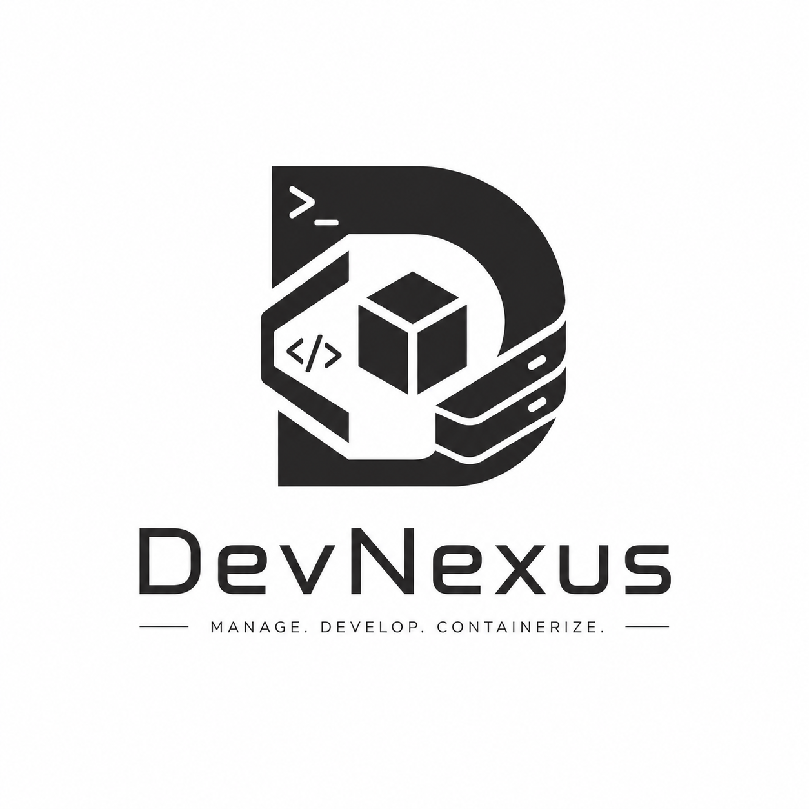
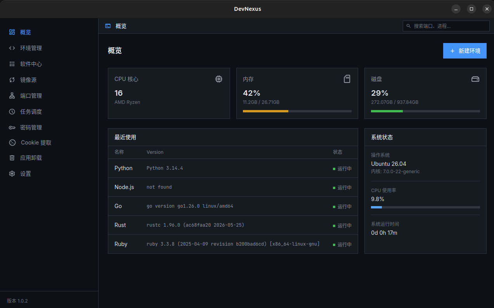
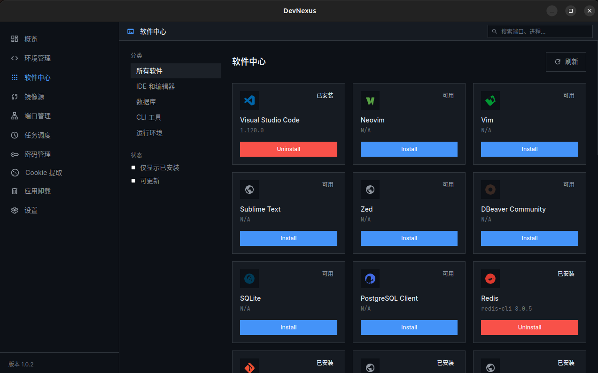
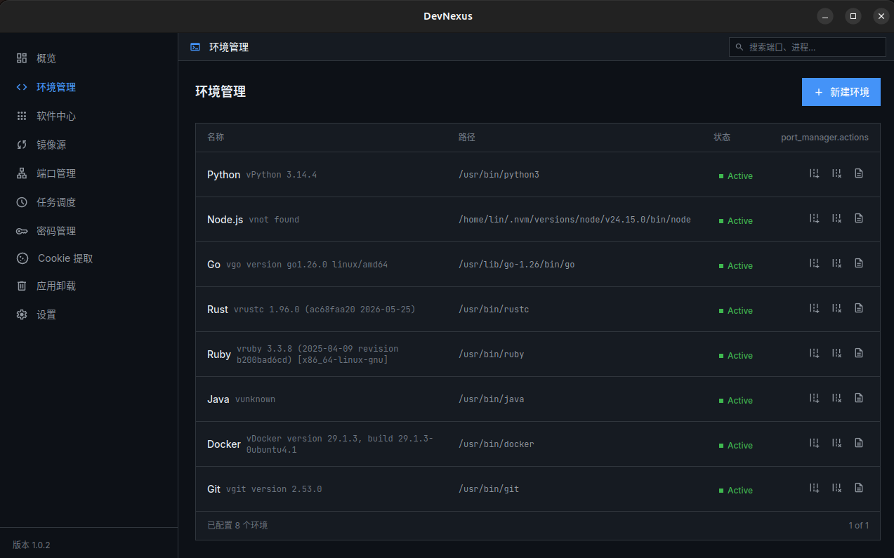
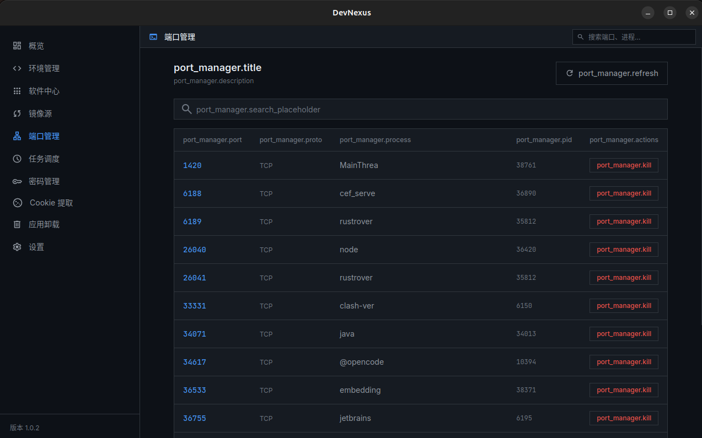

<br>

# DevNexus 
> One-stop cross-platform developer toolchain manager — Control your entire dev environment with GUI

[](LICENSE)
[]()
[](https://tauri.app/)
[](https://www.rust-lang.org/)

<p align="center">
  
</p>
<div align="center">
  <strong><a href="README.md">中文</a> | English | <a href="README.ru.md">Русский</a></strong>
</div>

---

## Introduction

DevNexus is a **cross-platform desktop application** that integrates everyday developer environment management tasks into a lightweight GUI:

- **Software Center** — Visual management of system packages (brew / apt / winget / choco / pip / npm)
- **Environment Manager** — Edit PATH, environment variables, dotfile configurations
- **Container Manager** — Docker/Podman containers, images, volumes, networks management
- **API Hub** — Local AI unified gateway, multi-protocol format conversion
- **Mirror Settings** — One-click configuration for pip / npm / apt mirror sources
- **System Dashboard** — Real-time CPU, memory, disk, and runtime version monitoring
- **Global Settings** — App preferences and theme management

Only **~10MB** installation, **~60MB** memory usage — say goodbye to Electron bloat.

---

## Development Docs

Detailed module design, cross-platform implementation, and development guide are available in the [`docs/`](docs/) directory:

| Document | Description |
|----------|-------------|
| [Architecture Overview](docs/architecture.md) | Module dependencies, data flow, security boundaries |
| [Development Guide](docs/dev-guide.md) | Setup, coding standards, build, debugging |
| [System Dashboard](docs/modules/01-system.md) | sysinfo + OnceLock disk caching |
| [Software Center](docs/modules/02-software.md) | 37 tools, 9 package managers, cross-platform mapping |
| [Environment Manager](docs/modules/03-environment.md) | Runtime detection, Unix/Windows PATH editing |
| [Container Manager](docs/modules/13-containers.md) | Docker/Podman containers, images, volumes, networks |
| [API Hub](docs/modules/11-api-hub.md) | Local AI gateway, multi-protocol format conversion |
| [Mirror Settings](docs/modules/04-mirror.md) | 12 package source switches, latency testing |
| [Port Manager](docs/modules/05-port.md) | lsof / procfs / netstat three-platform solution |
| [Task Scheduler](docs/modules/06-scheduler.md) | Cron engine, Shell/Python execution, system actions |
| [Password Manager](docs/modules/07-password.md) | AES-256-GCM + PBKDF2 + SQLite |
| [Cookie Extractor](docs/modules/08-cookie.md) | 5 browsers, 3 encryption mechanisms |
| [Deep Uninstall](docs/modules/09-uninstall.md) | Residue path DB + keyword scanning |
| [Version Manager](docs/modules/10-version.md) | pyenv/fnm/jenv/rustup/gvm unified API |
| [Cross-Platform Deep Dive](docs/modules/99-cross-platform.md) | 3-layer strategy, path mapping, command difference tables |

---

## Screenshots

|  |
|:--:|
| *Dashboard — Real-time CPU, memory, and disk info* |

|  |  |
|:--:|:--:|
| *Software Center — Visual system package management* | *Environment Manager — Visual PATH & env var editor* |

|  |
|:--:|
| *Port Manager — View and manage local port usage* |

---

## Why DevNexus?

Developers face these fragmented tools every day:

| Task | Current Solutions | Problems |
|---|---|---|
| Install dev tools | `brew install` / `apt install` / `winget` | Different commands per platform, no unified view |
| Manage SDK versions | nvm / pyenv / asdf / sdkman | CLI-only, poor Windows support |
| Switch env variables | Manually edit `.bashrc` / `.zshrc` | Error-prone, no visualization |
| Configure mirrors | Look up docs separately | Tedious, hard to remember |
| View system info | `htop` / `df` / `node -v` everywhere | No centralized panel |

**DevNexus integrates all of this into a single GUI.** No need to memorize commands or switch between tools.

---

## Comparison

| Feature | **DevNexus** | [nvm-desktop](https://github.com/1111mp/nvm-desktop) ⭐1.3k | [VMR](https://github.com/gvcgo/version-manager) ⭐1.3k | [vfox](https://github.com/version-fox/vfox) ⭐3.8k | [DevTool Manager](https://github.com/dengyuwu/dev-tools) | [DevTools-X](https://github.com/fosslife/devtools-x) ⭐1.5k |
|---|:---:|:---:|:---:|:---:|:---:|:---:|
| **GUI** | ✅ | ✅ | ❌ TUI | ❌ CLI | ✅ | ✅ |
| **Install Size** | ~10MB | ~30MB | ~8MB | ~5MB | ~15MB | ~10MB |
| **System Pkg Mgr** (brew/apt/winget) | ✅ | ❌ | ❌ | ❌ | ❌ | ❌ |
| **Multi-runtime Mgr** | ✅ | ❌ Node only | ✅ 30+ SDKs | ✅ Plugin-based | ❌ | ❌ |
| **npm/cargo/pip globals** | ✅ | ❌ | ❌ | ❌ | ✅ | ❌ |
| **Env Var / PATH Editor** | ✅ | ❌ | ❌ | ❌ | ❌ | ❌ |
| **Mirror Config** | ✅ | ✅ | ✅ | ❌ | ❌ | ❌ |
| **System Dashboard** | ✅ | ❌ | ❌ | ❌ | ✅ | ❌ |
| **macOS** | ✅ | ✅ | ✅ | ✅ | ✅ | ✅ |
| **Linux** | ✅ | ✅ | ✅ | ✅ | ✅ | ✅ |
| **Windows** | ✅ | ✅ | ✅ | ✅ | ✅ | ✅ |
| **Stack** | Tauri+Svelte+Rust | Tauri+React+Rust | Go | Go | Tauri+React+Rust | Tauri+React+Rust |

**Key Differences:**

- **nvm-desktop** — Only manages Node.js versions, limited scope
- **VMR / vfox** — Powerful but pure CLI/TUI, no visual interface
- **DevTool Manager** — Only manages npm/cargo/pip global packages, no system-level env
- **DevTools-X** — Developer utility collection (JSON formatter, JWT parser, etc.), not an environment manager
- **DevNexus** — **The only project that integrates system package management + multi-runtime versions + env variables + mirror config into one GUI**

---

## Architecture

```
┌──────────────────────────────────────────────┐
│              Frontend (Svelte 5)              │
│           Tailwind CSS · svelte-spa-router     │
├──────────────────────────────────────────────┤
│            Tauri 2.0 IPC Bridge              │
│         invoke() / emit() / Channel          │
├──────────────────────────────────────────────┤
│              Backend (Rust)                   │
│  ┌─────────┬──────────┬──────────┬─────────┐  │
│  │ pkg_mgr │ env_mgr  │ scheduler│ sysinfo │  │
│  │ brew/   │ PATH &   │ cron/    │ CPU/    │  │
│  │ apt/    │ dotfile  │ shell    │ MEM/Disk│  │
│  │ winget  │ parser   │ python   │ which   │  │
│  └─────────┴──────────┴──────────┴─────────┘  │
└──────────────────────────────────────────────┘
```

### Tech Stack

| Layer | Technology | Description |
|---|---|---|
| **Desktop Framework** | [Tauri 2.0](https://tauri.app/) | Native system Webview, not Electron |
| **Frontend** | [Svelte 5](https://svelte.dev/) | Compile-time framework, only ~2KB runtime |
| **Styling** | [Tailwind CSS](https://tailwindcss.com/) | Utility-first CSS |
| **Backend Language** | [Rust](https://www.rust-lang.org/) | System calls, performance, memory safety |
| **Async Runtime** | [tokio](https://crates.io/crates/tokio) | Rust async I/O |
| **System Info** | [sysinfo](https://crates.io/crates/sysinfo) | CPU/Memory/Disk/Process |
| **Executable Lookup** | [which](https://crates.io/crates/which) | Cross-platform PATH lookup |
| **Serialization** | [serde](https://crates.io/crates/serde) | JSON/TOML config read/write |

### Why This Stack?

- **Tauri over Electron** — 10MB vs 150MB install, 60MB vs 300MB memory, uses system Webview instead of bundled Chromium
- **Svelte over React** — Compile-time elimination of framework runtime, smaller output; native HTML syntax, zero-cost migration from design prototypes
- **Rust over Node.js** — Native system call capabilities, memory safe

---

## Project Structure

```
devnexus/
├── src/                          # Svelte Frontend
│   ├── lib/
│   │   ├── stores.svelte.js      # Router & search state
│   │   ├── i18n.svelte.js        # i18n (zh/en/ru)
│   │   ├── toast.svelte.js
│   │   └── confirm.svelte.js
│   ├── locales/                  # Translation files
│   │   ├── zh.json
│   │   ├── en.json
│   │   └── ru.json
│   ├── routes/                   # Page routes
│   │   ├── Dashboard.svelte      # System dashboard
│   │   ├── EnvironmentManager.svelte
│   │   ├── SoftwareCenter.svelte
│   │   ├── ContainerManager.svelte # Container management
│   │   ├── ApiHub.svelte         # API Hub
│   │   ├── MirrorSettings.svelte
│   │   ├── ProcessManager.svelte # Process/port management
│   │   ├── PasswordManager.svelte
│   │   ├── CookieExtractor.svelte
│   │   ├── AppUninstaller.svelte # Deep uninstall
│   │   ├── Migration.svelte      # Environment migration
│   │   ├── Settings.svelte
│   │   └── ...
│   ├── components/
│   │   ├── Sidebar.svelte
│   │   ├── TitleBar.svelte
│   │   ├── ConfirmDialog.svelte
│   │   ├── Toast.svelte
│   │   └── ErrorBoundary.svelte
│   ├── App.svelte
│   └── main.js
├── src-tauri/                    # Rust Backend
│   ├── src/
│   │   ├── main.rs
│   │   ├── lib.rs
│   │   ├── commands/
│   │   │   ├── system.rs         # System info
│   │   │   ├── environment.rs    # PATH/env variables
│   │   │   ├── software.rs       # Package management
│   │   │   ├── container.rs      # Docker/Podman management
│   │   │   ├── api_hub/          # API Hub module
│   │   │   ├── mirror.rs         # Mirror sources
│   │   │   ├── port_manager.rs   # Process/port management
│   │   │   ├── scheduler.rs      # Task scheduling
│   │   │   ├── password_manager.rs
│   │   │   ├── cookie_extractor.rs
│   │   │   ├── version_manager.rs
│   │   │   ├── migration.rs      # Environment migration
│   │   │   ├── updater.rs        # Auto update
│   │   │   └── mod.rs
│   │   └── ...
│   ├── icons/
│   ├── Cargo.toml
│   └── tauri.conf.json
├── scripts/
├── .github/workflows/
│   ├── build.yml                 # CI auto build
│   └── release-cleanup.yml       # Auto-clean old releases
├── package.json
├── CHANGELOG.md
└── README.md
```

---

## Development Guide

### Prerequisites

- [Node.js](https://nodejs.org/) >= 20
- [Rust](https://rustup.rs/) >= 1.80
- System dependencies ([Tauri prerequisites](https://v2.tauri.app/start/prerequisites/))

### Install Dependencies

```bash
pnpm install
```

### Development Mode

```bash
pnpm tauri dev
```

### Build for Production

```bash
pnpm tauri build
```

Build artifacts:
- **macOS**: `.dmg` / `.app`
- **Linux**: `.deb` / `.rpm` / AppImage
- **Windows**: `.msi` / `.exe`

---

## Roadmap

### Completed

- [x] Docker/Podman container management
- [x] API Hub (local AI gateway, multi-protocol streaming)
- [x] Environment migration system
- [x] System package manager backend (brew / apt / winget)
- [x] Software Center UI & backend integration
- [x] Environment variable read/write & visual editor
- [x] Mirror source configuration
- [x] System info dashboard
- [x] Process/port manager
- [x] Task scheduler (Cron engine + Shell/Python/system actions)
- [x] Password manager (AES-256-GCM + SQLite)
- [x] Cookie extraction (5 browsers)
- [x] Deep uninstall (residue scanning + registry + shortcuts)
- [x] Version manager (pyenv/fnm/jenv/gvm/rustup/gcc)
- [x] Theme & internationalization (zh / en / ru)
- [x] Auto-update + bilingual changelog

### Planned

- [ ] Cloud service credential management (AWS / GCP CLI)

---

## License

[MIT](LICENSE)
