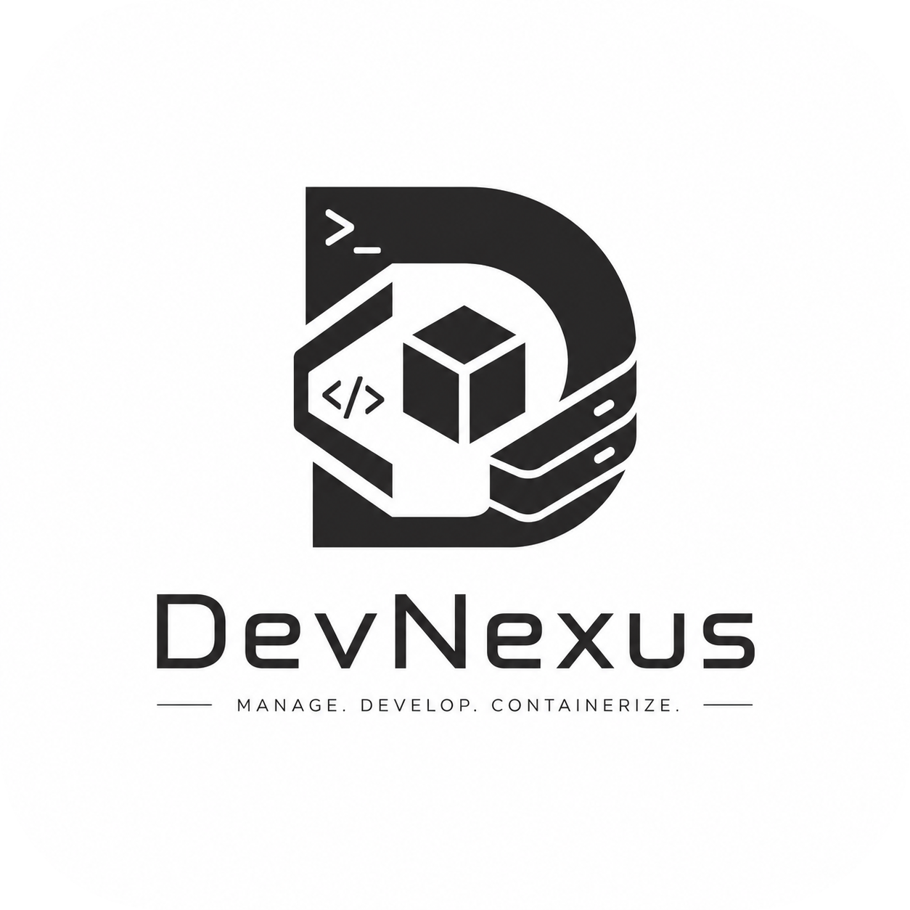
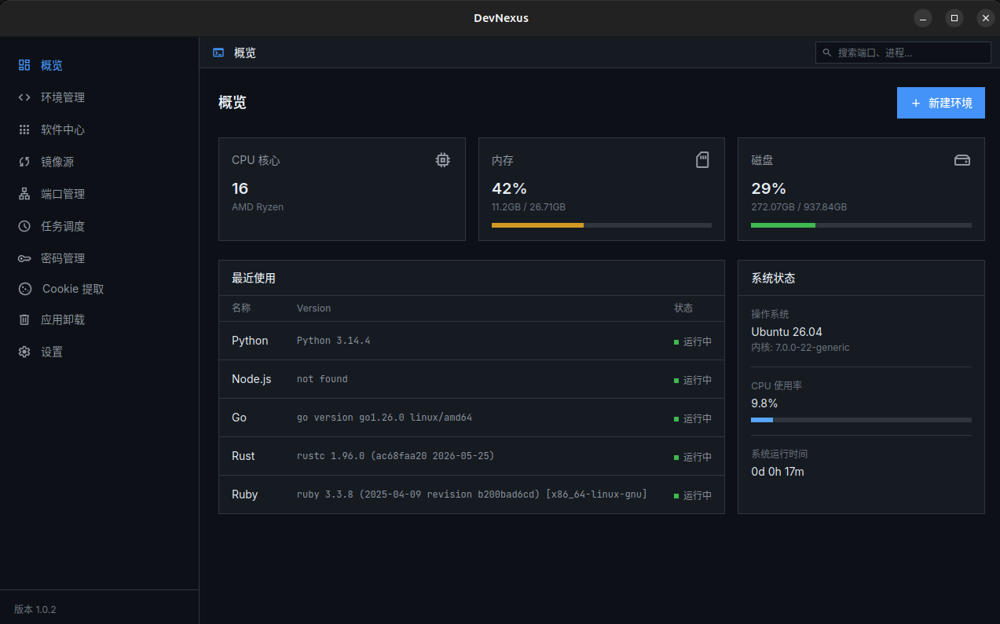
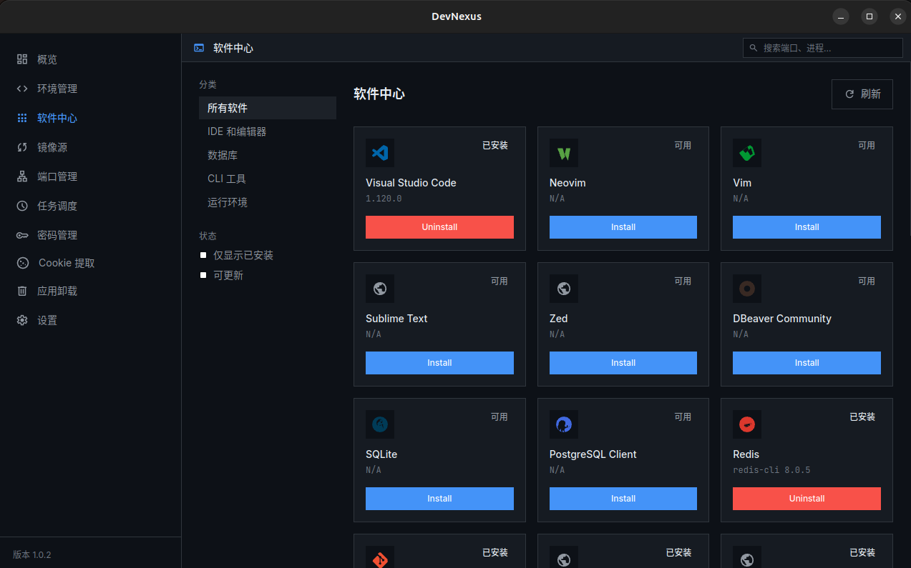
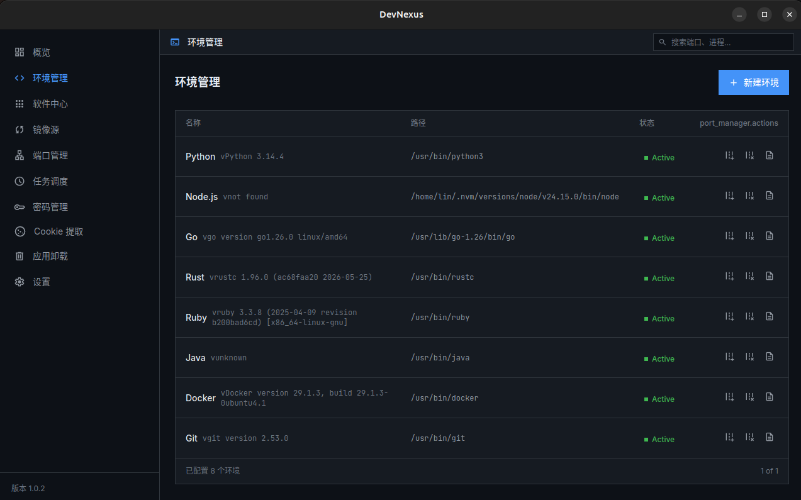
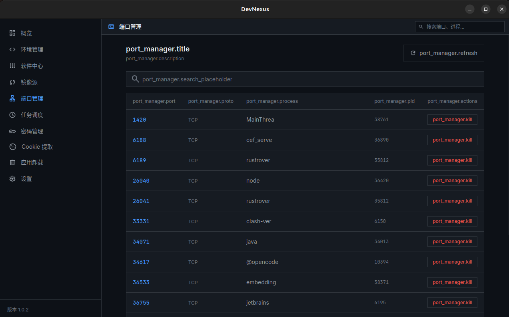

<br>

# DevNexus 
> Кроссплатформенный менеджер инструментов разработчика — управляйте средой разработки через GUI

[](LICENSE)
[]()
[](https://tauri.app/)
[](https://www.rust-lang.org/)

<p align="center">
  
</p>
<div align="center">
  <strong><a href="README.md">中文</a> | <a href="README.en.md">English</a> | Русский</strong>
</div>

---

## Описание

DevNexus — это **кроссплатформенное десктопное приложение**, объединяющее повседневные задачи управления средой разработки в лёгком GUI:

- **Центр ПО** — Визуальное управление системными пакетами (brew / apt / winget / choco / pip / npm)
- **Менеджер окружения** — Редактирование PATH, переменных окружения, конфигураций dotfile
- **Зеркала** — Настройка источников pip / npm / apt в один клик
- **Панель системы** — Мониторинг CPU, памяти, диска и версий runtime в реальном времени
- **Настройки** — Управление предпочтениями и темами приложения

Установочный пакет всего **~10 МБ**, потребление памяти **~60 МБ** — забудьте о раздутости Electron.

---

## Документация разработчика

Подробное описание модулей, кроссплатформенной реализации и руководство разработчика находятся в каталоге [`docs/`](docs/):

| Документ | Описание |
|----------|---------|
| [Архитектура](docs/architecture.md) | Зависимости модулей, потоки данных, границы безопасности |
| [Руководство разработчика](docs/dev-guide.md) | Настройка среды, стандарты кода, сборка, отладка |
| [Панель системы](docs/modules/01-system.md) | sysinfo + OnceLock кэширование диска |
| [Центр ПО](docs/modules/02-software.md) | 37 инструментов, 9 менеджеров пакетов |
| [Менеджер окружения](docs/modules/03-environment.md) | Детектирование runtime, редактирование PATH |
| [Зеркала](docs/modules/04-mirror.md) | 12 источников пакетов, тестирование задержки |
| [Менеджер портов](docs/modules/05-port.md) | lsof / procfs / netstat для трёх платформ |
| [Планировщик задач](docs/modules/06-scheduler.md) | Cron, выполнение Shell/Python, действия системы |
| [Менеджер паролей](docs/modules/07-password.md) | AES-256-GCM + PBKDF2 + SQLite |
| [Извлечение Cookie](docs/modules/08-cookie.md) | 5 браузеров, 3 механизма шифрования |
| [Глубокое удаление](docs/modules/09-uninstall.md) | База путей остатков + поиск по ключевым словам |
| [Менеджер версий](docs/modules/10-version.md) | pyenv/fnm/jenv/rustup/gvm единый API |
| [Кроссплатформенность](docs/modules/99-cross-platform.md) | 3-уровневая стратегия, сопоставление путей |

---

## Скриншоты

|  |
|:--:|
| *Панель обзора — CPU, память и информация о диске в реальном времени* |

|  |  |
|:--:|:--:|
| *Центр ПО — Визуальное управление системными пакетами* | *Менеджер окружения — Визуальный редактор PATH и переменных* |

|  |
|:--:|
| *Менеджер портов — Просмотр и управление локальными портами* |

---

## Зачем нужен DevNexus?

Разработчики ежедневно сталкиваются с разрозненными инструментами:

| Задача | Текущие решения | Проблемы |
|---|---|---|
| Установка инструментов | `brew install` / `apt install` / `winget` | Разные команды для каждой платформы |
| Управление версиями SDK | nvm / pyenv / asdf / sdkman | Только CLI, плохая поддержка Windows |
| Переключение переменных окружения | Ручное редактирование `.bashrc` / `.zshrc` | Ошибкоопасно, без визуализации |
| Настройка зеркал | Поиск документации отдельно | Утомительно, сложно запомнить |
| Просмотр инфо о системе | `htop` / `df` / `node -v` повсюду | Нет единой панели |

**DevNexus объединяет всё это в одном GUI.** Не нужно запоминать команды или переключаться между инструментами.

---

## Сравнение с аналогами

| Функция | **DevNexus** | [nvm-desktop](https://github.com/1111mp/nvm-desktop) ⭐1.3k | [VMR](https://github.com/gvcgo/version-manager) ⭐1.3k | [vfox](https://github.com/version-fox/vfox) ⭐3.8k | [DevTool Manager](https://github.com/dengyuwu/dev-tools) | [DevTools-X](https://github.com/fosslife/devtools-x) ⭐1.5k |
|---|:---:|:---:|:---:|:---:|:---:|:---:|
| **GUI** | ✅ | ✅ | ❌ TUI | ❌ CLI | ✅ | ✅ |
| **Размер установки** | ~10 МБ | ~30 МБ | ~8 МБ | ~5 МБ | ~15 МБ | ~10 МБ |
| **Системные пакеты** (brew/apt/winget) | ✅ | ❌ | ❌ | ❌ | ❌ | ❌ |
| **Мульти-runtime** | ✅ | ❌ Только Node | ✅ 30+ SDK | ✅ Плагины | ❌ | ❌ |
| **npm/cargo/pip** | ✅ | ❌ | ❌ | ❌ | ✅ | ❌ |
| **Редактор переменных / PATH** | ✅ | ❌ | ❌ | ❌ | ❌ | ❌ |
| **Настройка зеркал** | ✅ | ✅ | ✅ | ❌ | ❌ | ❌ |
| **Панель системы** | ✅ | ❌ | ❌ | ❌ | ✅ | ❌ |
| **macOS** | ✅ | ✅ | ✅ | ✅ | ✅ | ✅ |
| **Linux** | ✅ | ✅ | ✅ | ✅ | ✅ | ✅ |
| **Windows** | ✅ | ✅ | ✅ | ✅ | ✅ | ✅ |
| **Стек** | Tauri+Svelte+Rust | Tauri+React+Rust | Go | Go | Tauri+React+Rust | Tauri+React+Rust |

**Ключевые отличия:**

- **nvm-desktop** — Управляет только версиями Node.js, ограниченный функционал
- **VMR / vfox** — Мощные, но только CLI/TUI, без графического интерфейса
- **DevTool Manager** — Только глобальные пакеты npm/cargo/pip, без системного окружения
- **DevTools-X** — Набор утилит для разработчиков (JSON, JWT и т.д.), не менеджер окружения
- **DevNexus** — **Единственный проект, объединяющий управление пакетами + мульти-runtime + переменные окружения + настройку зеркал в одном GUI**

---

## Архитектура

```
┌──────────────────────────────────────────────┐
│              Frontend (Svelte 5)              │
│           Tailwind CSS · svelte-spa-router     │
├──────────────────────────────────────────────┤
│            Tauri 2.0 IPC Bridge              │
│         invoke() / emit() / Channel          │
├──────────────────────────────────────────────┤
│              Backend (Rust)                   │
│  ┌─────────┬──────────┬──────────┬─────────┐  │
│  │ pkg_mgr │ env_mgr  │ scheduler│ sysinfo │  │
│  │ brew/   │ PATH &   │ cron/    │ CPU/    │  │
│  │ apt/    │ dotfile  │ shell    │ MEM/Disk│  │
│  │ winget  │ parser   │ python   │ which   │  │
│  └─────────┴──────────┴──────────┴─────────┘  │
└──────────────────────────────────────────────┘
```

### Технологический стек

| Слой | Технология | Описание |
|---|---|---|
| **Десктоп-фреймворк** | [Tauri 2.0](https://tauri.app/) | Системный Webview, не Electron |
| **Фронтенд** | [Svelte 5](https://svelte.dev/) | Компилируемый фреймворк, runtime ~2 КБ |
| **Стили** | [Tailwind CSS](https://tailwindcss.com/) | Утилитарный CSS |
| **Язык бэкенда** | [Rust](https://www.rust-lang.org/) | Системные вызовы, производительность, безопасность памяти |
| **Асинхронный runtime** | [tokio](https://crates.io/crates/tokio) | Асинхронный I/O для Rust |
| **Системная информация** | [sysinfo](https://crates.io/crates/sysinfo) | CPU/Память/Диск/Процессы |
| **Поиск исполняемых файлов** | [which](https://crates.io/crates/which) | Кроссплатформенный поиск в PATH |
| **Сериализация** | [serde](https://crates.io/crates/serde) | Чтение/запись конфигураций JSON/TOML |

### Почему этот стек?

- **Tauri вместо Electron** — 10 МБ vs 150 МБ установка, 60 МБ vs 300 МБ память, системный Webview вместо встроенного Chromium
- **Svelte вместо React** — Компилируемый фреймворк без runtime, меньший размер; нативный HTML-синтаксис, нулевая стоимость миграции с дизайн-прототипов
- **Rust вместо Node.js** — Нативные системные вызовы, безопасность памяти

---

## Структура проекта

```
devnexus/
├── src/                          # Svelte фронтенд
│   ├── lib/
│   │   ├── stores.js             # Состояние маршрутизации и поиска
│   │   └── i18n.js               # Интернационализация (zh/en/ru)
│   ├── locales/                  # Файлы переводов
│   │   ├── zh.json
│   │   ├── en.json
│   │   └── ru.json
│   ├── routes/                   # Маршруты страниц
│   │   ├── Dashboard.svelte      # Панель системы
│   │   ├── EnvironmentManager.svelte
│   │   ├── SoftwareCenter.svelte
│   │   ├── MirrorSettings.svelte
│   │   ├── PortManager.svelte    # Управление портами
│   │   ├── TaskScheduler.svelte
│   │   ├── PasswordManager.svelte
│   │   ├── CookieExtractor.svelte
│   │   ├── AppUninstaller.svelte # Глубокое удаление
│   │   ├── VersionManager.svelte # Управление версиями
│   │   └── Settings.svelte
│   ├── components/
│   │   ├── Sidebar.svelte
│   │   ├── TopBar.svelte
│   │   └── TitleBar.svelte
│   ├── app.svelte
│   └── main.js
├── src-tauri/                    # Rust бэкенд
│   ├── src/
│   │   ├── main.rs
│   │   ├── lib.rs
│   │   └── commands/
│   │       ├── system.rs         # Системная информация
│   │       ├── environment.rs    # PATH/переменные окружения
│   │       ├── software.rs       # Управление пакетами
│   │       ├── mirror.rs         # Зеркала
│   │       ├── port_manager.rs   # Управление портами
│   │       ├── scheduler.rs      # Планировщик задач
│   │       ├── password_manager.rs
│   │       ├── cookie_extractor.rs
│   │       ├── version_manager.rs # Управление версиями (pyenv/fnm/jenv/gvm/rustup)
│   │       ├── updater.rs         # Автообновление
│   │       └── mod.rs
│   ├── icons/
│   │   └── DevNexus.png          # Исходная иконка приложения
│   ├── Cargo.toml
│   └── tauri.conf.json
├── scripts/
│   └── generate_icons.py         # Скрипт конвертации иконок
├── .github/workflows/
│   └── build.yml                 # CI автоматическая сборка
├── package.json
└── README.md
```

---

## Руководство по разработке

### Требования

- [Node.js](https://nodejs.org/) >= 20
- [Rust](https://rustup.rs/) >= 1.80
- Системные зависимости ([Требования Tauri](https://v2.tauri.app/start/prerequisites/))

### Установка зависимостей

```bash
pnpm install
```

### Режим разработки

```bash
pnpm tauri dev
```

### Сборка для продакшена

```bash
pnpm tauri build
```

Артефакты сборки:
- **macOS**: `.dmg` / `.app`
- **Linux**: `.deb` / `.rpm` / AppImage
- **Windows**: `.msi` / `.exe`

---

## Дорожная карта

### Завершено ✅

- [ ] Создание скелета проекта
- [ ] Бэкенд системного менеджера пакетов (brew / apt / winget)
- [ ] UI Центра ПО и интеграция с бэкендом
- [ ] Чтение/запись переменных окружения и визуальный редактор
- [ ] Настройка источников зеркал
- [ ] Панель информации о системе
- [ ] Управление портами (lsof / procfs / netstat)
- [ ] Менеджер процессов (список процессов + группировка + завершение)
- [ ] Планировщик задач (Cron + Shell/Python/действия системы)
- [ ] Менеджер паролей (AES-256-GCM + SQLite)
- [ ] Извлечение Cookie (5 браузеров)
- [ ] Глубокое удаление (сканирование остатков + реестр + ярлыки)
- [ ] Менеджер версий (pyenv/fnm/jenv/gvm/rustup/gcc)
- [ ] Темы и интернационализация (zh / en / ru)
- [ ] Автообновление (GitHub Release + updater plugin)

### В процессе / Планируется 🚧

- [ ] Docker / Podman управление контейнерами
- [ ] Конфигурация облачных сервисов (AWS / GCP CLI)

---

## Лицензия

[MIT](LICENSE)
